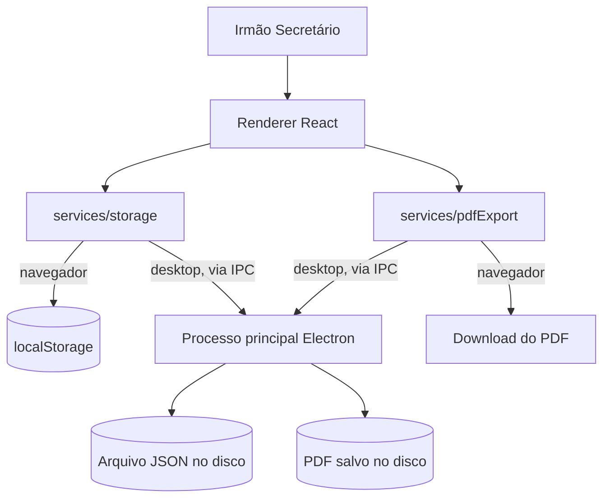
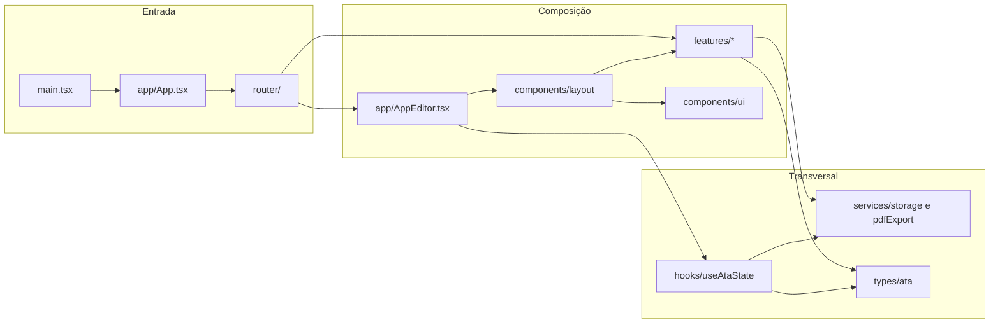

# Arquitetura

Este documento descreve a arquitetura do Mesa do Secretário: os alvos de execução, a estrutura de diretórios, os princípios de organização do código e as decisões de projeto que sustentam a aplicação.

Para as regras de implementação, consulte [Padrões de Código](Padroes-de-Codigo). Para o inventário de bibliotecas, consulte [Dependências](Dependencias). Para as fronteiras violadas e a dívida técnica aberta, consulte [Acoplamento e Dívida Técnica](Acoplamento-e-Divida-Tecnica).

---

## Visão Geral

O Mesa do Secretário é uma aplicação de página única, escrita em React 19 e TypeScript, que lavra atas de sessão maçônica e as exporta em PDF. Ela roda em dois alvos a partir do mesmo código-fonte:

- **web**, publicada na Vercel;
- **desktop**, empacotada em Electron para Windows e macOS.

Toda a persistência é local. Não há servidor de aplicação, banco de dados remoto nem autenticação: os dados da loja, dos obreiros e do rascunho da ata vivem no navegador ou no disco da máquina.

O código adota a **Feature-Sliced Architecture** (FSA), introduzida na versão 0.2.0: a aplicação é dividida em _domains_ verticais autocontidos, chamados _feature slices_, cada um com seus componentes, _hooks_, dados e tipos.



_O mesmo renderer atende os dois alvos. A escolha do meio de persistência e de exportação é feita em tempo de execução, pela presença da ponte `window.electronAPI`._

---

## Camadas



_As setas mostram a direção real dos imports. `components/layout` importa de `features`, e não o contrário._

| Camada          | Diretório                | Responsabilidade                                                      |
| --------------- | ------------------------ | --------------------------------------------------------------------- |
| Entrada         | `src/main.tsx`           | Monta a aplicação no DOM                                              |
| Composição raiz | `src/app/`               | `App.tsx` delega ao roteador; `AppEditor.tsx` compõe a tela de edição |
| Navegação       | `src/router/`            | Tabela de rotas e guardas de acesso                                   |
| Features        | `src/features/`          | Domínios verticais autocontidos                                       |
| Layout          | `src/components/layout/` | Estrutura visual: barra lateral, área de pré-visualização             |
| UI              | `src/components/ui/`     | Componentes genéricos sem regra de negócio                            |
| Estado global   | `src/hooks/`             | `useAtaState`, estado completo da ata                                 |
| Serviços        | `src/services/`          | Persistência e exportação em PDF                                      |
| Shell desktop   | `src/electron/`          | Processo principal, ponte de contexto e canais IPC                    |
| Tipos           | `src/types/`             | Contratos compartilhados                                              |
| Estilos         | `src/styles/`            | CSS fatiado por tema                                                  |
| Apoio a teste   | `src/test/`              | _Render_ com provedores, fábricas e _seed_ de armazenamento           |

---

## Feature Slices

Dez _features_ vivem em `src/features/`:

| Feature       | O que resolve                                             |
| ------------- | --------------------------------------------------------- |
| `ata`         | Módulo de ata por rito: registry, rotas e documentos      |
| `bolsa`       | Bolsa de Propostas e Informações                          |
| `config`      | Tela de configurações                                     |
| `home`        | Tela inicial com cartões de acesso rápido                 |
| `loja-config` | Cadastro de lojas, obreiros, gestões e cargos             |
| `officers`    | Oficiais da sessão                                        |
| `palavra`     | Palavra a Bem da Ordem, por coluna ou em texto corrido    |
| `preview`     | Pré-visualização A4 e exportação em PDF                   |
| `session`     | Tipo de sessão, campos de sessão magna e conjunta, tronco |
| `visitors`    | Visitantes presentes                                      |

Estrutura interna de um _slice_:

```
src/features/<nome>/
├── components/       # Componentes React da feature
├── hooks/            # Hooks da feature (quando houver)
├── data/             # Tabelas e regras de domínio (quando houver)
├── types.ts          # Tipos específicos da feature
└── index.ts          # Barrel export — API pública
```

> **Nota**: o módulo `documents` foi removido na versão 0.3.0. A regra de importar apenas pelo barrel export permanece em vigor, mas hoje é descumprida em 27 pontos e não é imposta por ferramenta — ver [Acoplamento e Dívida Técnica](Acoplamento-e-Divida-Tecnica).

---

## Módulo de Ata por Rito

Introduzido na versão 0.8.0, é a decisão arquitetural mais recente e a que mais afeta a extensão do sistema.

O núcleo — estado da sessão, barra lateral, folha A4, impressão e exportação — é compartilhado. Cada rito contribui apenas com o seu documento, as suas seções e os seus oficiais, registrados num mapa `Rito → ModuloAta` em `src/features/ata/registry.ts:9`:

```typescript
export const MODULOS_ATA: Record<Rito, ModuloAta> = {
  'Rito Escocês Antigo e Aceito': MODULO_ESCOCES,
  'Rito Adonhiramita': MODULO_ADONHIRAMITA,
  'Rito de York': MODULO_YORK,
  'Rito de Emulação': MODULO_EMULACAO,
};
```

A resolução acontece por duas portas (`registry.ts:20` e `registry.ts:25`): pelo rito cadastrado na loja, e pelo trecho da URL, quando alguém digita `/ata/<slug>` à mão.



```mermaid
graph TD
    A["/ata"] --> AR[AtaRedirect]
    AR --> RG{rito cadastrado<br/>na loja?}
    RG -->|sim| MOD["/ata/&lt;slug&gt; do rito"]
    RG -->|não| HOME["/ — modal de boas-vindas"]
    B["/ata/&lt;slug&gt; digitado"] --> ARS[AtaRitoScreen]
    ARS --> CHK{slug confere com<br/>o rito da loja?}
    CHK -->|sim| DOC[Documento do rito]
    CHK -->|não| MOD
```

_Um único endereço serve a todos os ritos; o cadastro da loja decide qual módulo abre. Acrescentar um rito é acrescentar um módulo e uma entrada no registry, sem tocar na tabela de rotas._

---

## Navegação

A tabela de rotas vive em `src/router/routes.ts`, separada da montagem do roteador desde a versão 0.8.0. O roteador é o `wouter`.

Duas decisões merecem registro:

1. **Guarda de configuração** — `src/router/index.tsx:22-30`: enquanto faltar dado obrigatório da loja, qualquer rota digitada volta para a tela inicial, onde o modal de boas-vindas permanece aberto. A única rota sempre acessível é `/config/loja`, justamente onde os dados pendentes são cadastrados.
2. **Modo de endereço por alvo** — `src/router/index.tsx:62-63`: no desktop o roteador usa _hash location_, porque o Electron carrega o HTML por `file://`; na web usa o histórico do navegador, com a reescrita de rotas declarada no `vercel.json`.

---

## Estado e Persistência

O estado da ata é centralizado em `src/hooks/useAtaState.ts` (426 linhas), com _hooks_ nativos do React. Nenhuma biblioteca de gerenciamento de estado é usada.

A persistência é abstraída por `src/services/storage.ts` (446 linhas), que escolhe o meio conforme o alvo:

- **web**: `localStorage`;
- **desktop**: ponte `window.electronAPI.storage`, que trafega por IPC síncrono até o processo principal.

O processo principal aceita apenas as chaves de uma lista fechada (`src/electron/main.ts:19`, `ALLOWED_STORAGE_KEYS`): `ataDraft`, `officersConfig`, `lojaConfig`, `lojasCadastro`, `obreiros` e `gestoes`. Chave fora da lista é recusada.

---

## Segurança do Shell Desktop

Endurecimento aplicado na versão 0.3.0 (spec `005-electron-hardening`) e vigente:

| Medida                                   | Onde                       |
| ---------------------------------------- | -------------------------- |
| `nodeIntegration: false`                 | `src/electron/main.ts:262` |
| `contextIsolation: true`                 | `src/electron/main.ts:263` |
| `sandbox: true`                          | `src/electron/main.ts:264` |
| Navegação externa bloqueada              | `src/electron/main.ts:269` |
| Abertura de novas janelas negada         | `src/electron/main.ts:275` |
| Superfície IPC declarada e tipada        | `src/electron/preload.ts`  |
| Chaves de armazenamento em lista fechada | `src/electron/main.ts:19`  |

A senha do PDF nunca cruza a ponte: o processo principal devolve o PDF cru e grava os bytes que o _renderer_ já criptografou (`src/electron/preload.ts`, bloco `pdf`).

---

## Política de Conteúdo

A `Content-Security-Policy` é reescrita no `index.html` em tempo de _build_, conforme o alvo, pelo plugin `csp-por-alvo` em `vite.config.ts`. O plugin **interrompe o build** se a meta desaparecer do HTML, para que nenhum artefato seja publicado sem política. A liberação de `localhost` e do WebSocket existe apenas no servidor de desenvolvimento, onde o HMR depende dela.

Na web, os cabeçalhos de segurança são entregues pelo `vercel.json`, porque `frame-ancestors` só vale como cabeçalho HTTP.

---

## Ver Também

- [Padrões de Código](Padroes-de-Codigo) — convenções de implementação
- [Dependências](Dependencias) — inventário de bibliotecas
- [Acoplamento e Dívida Técnica](Acoplamento-e-Divida-Tecnica) — fronteiras violadas e plano de correção
- [Histórico de Versões](Historico-de-Versoes) — evolução arquitetural
- [Testes](Testes) — organização da suíte
