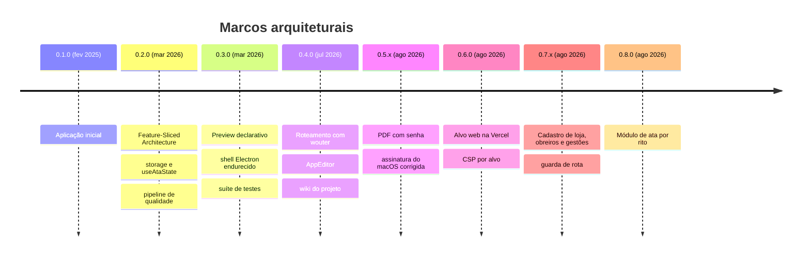

# Evolução Arquitetural

Este documento reconstitui como a arquitetura do Mesa do Secretário chegou ao estado atual, versão a versão. Registra apenas as mudanças que alteraram estrutura, fronteira ou alvo de execução.

Para o histórico completo de mudanças, incluindo comportamento e correções, consulte o `CHANGELOG.md` na raiz do repositório e a página [Changelog](Changelog).

---

## Linha do Tempo

---

## 0.1.0 — 8 de fevereiro de 2025

Aplicação inicial: uma página, estado local espalhado em componentes, CSS num arquivo único de 797 linhas.

## 0.2.0 — 18 de março de 2026

A versão que fundou a arquitetura atual. Quatro decisões nasceram aqui e continuam de pé:

1. **Feature-Sliced Architecture**, com sete _slices_ verticais e barrel export controlando a API pública de cada uma. Trinta e sete componentes saíram de `src/components/` para `src/features/<domínio>/components/`.
2. **Estado centralizado** em `useAtaState`, substituindo dezoito `useState` espalhados pelo `App.tsx`.
3. **Persistência encapsulada** em `services/storage.ts`, com a regra de nunca chamar `localStorage` fora dali.
4. **Pipeline de qualidade**: Prettier, ESLint com acessibilidade, Husky, commitlint, Vitest e Playwright.

O CSS foi fatiado em cinco arquivos temáticos, e `src/app/providers.tsx` foi criado como espaço reservado — que permanece vazio até hoje.

## 0.3.0 — 18 de março de 2026

Consolidação de segurança e de testes:

- A pré-visualização **deixou de injetar HTML** e passou a renderização declarativa em React, fechando a superfície de injeção que a spec `004-secure-preview-html` tratava.
- O shell Electron foi endurecido (spec `005-electron-hardening`): _preload_ seguro, regras de navegação, bloqueio de novas janelas e persistência mediada por IPC.
- Trinta e quatro arquivos de teste unitário entraram de uma vez, com auxiliares reutilizáveis em `src/test/`. A cobertura chegou a 93,90%.
- O módulo `documents` foi removido.

## 0.4.0 — 3 de julho de 2026

A aplicação deixou de ser uma tela só:

- **Roteamento com `wouter`**, e a edição da ata movida para `AppEditor`. `App.tsx` passou a delegar.
- Tela inicial com cartões de acesso rápido, cadastro de lojas e tela de configurações.
- A wiki do projeto foi criada, com oito páginas.

## 0.5.0 e 0.5.1 — 9 de agosto de 2026

- **Exportação de PDF com senha**, com o serviço `pdfExport.ts` e canal de IPC próprio no processo principal. A criptografia acontece no _renderer_: a senha nunca cruza a ponte.
- A assinatura do macOS foi refeita durante o empacotamento, e o identificador do _bundle_ passou de `Electron` para `com.glmese.mesadosecretario`.

## 0.6.0 — 20 de agosto de 2026

O projeto ganhou um **segundo alvo de execução**, e com ele a primeira divergência real de configuração entre alvos:

- Publicação na Vercel, com `vercel.json` versionando reescrita de rotas, cache e cabeçalhos de segurança.
- `base` relativo para o Electron, absoluto para a web — a raiz do problema que deixava rotas profundas com tela branca.
- `cspPlugin` em `vite.config.ts`, reescrevendo a política por alvo e **interrompendo o build** se a meta desaparecer do HTML.

## 0.7.0 e 0.7.1 — 21 e 24 de agosto de 2026

O domínio da loja deixou de ser dado fixo e virou cadastro:

- Tela de configuração da loja em três abas, com cadastro de **obreiros**, **gestões** e a tabela de cargos do Rito Escocês Antigo e Aceito.
- **Guarda de navegação**: sem os dados obrigatórios da loja, qualquer rota volta para a tela inicial com o modal de boas-vindas aberto.
- Bolsa de Propostas e Informações com registro estruturado, no lugar de texto livre.
- `domTranslationGuard`, protegendo as operações de DOM dos tradutores automáticos do navegador, que derrubavam a aplicação inteira.

## 0.8.0 — 29 de agosto de 2026

A decisão de extensibilidade mais importante até aqui: **um módulo de ata por rito**.

O núcleo compartilhado permaneceu, e cada rito passou a contribuir com o seu documento, as suas seções e os seus oficiais, registrados num mapa `Rito → ModuloAta`. Os cargos deixaram de ser nomes fixos no código e passaram a ser buscados no rito da loja.

A tabela de rotas saiu de `router/index.tsx` para `router/routes.ts`, e os ritos passaram a ocupar um só endereço, `/ata/:slug`, resolvido pelo cadastro da loja. Acrescentar um rito deixou de exigir mudança na navegação.

`src/router.ts`, arquivo morto que ninguém importava, foi removido.

---

## Leitura dos Marcos

Três linhas de força atravessam o histórico:

1. **Redução de superfície perigosa** — HTML injetado removido (0.3.0), shell endurecido (0.3.0), CSP por alvo com build que falha (0.6.0), senha que não cruza a ponte (0.5.0).
2. **Dado fixo virando cadastro** — lojas (0.4.0), obreiros e gestões (0.7.0), cargos por rito (0.8.0). A tendência sugere que o próximo candidato é o texto padrão das seções da ata.
3. **Generalização por registro, não por condicional** — o registry de ritos (0.8.0) substituiu o que seria uma cadeia de condicionais por rito. É o padrão a seguir quando um novo eixo de variação aparecer.

---

## Rotatividade e Risco

Os arquivos que participam de quase toda versão desde a 0.4.0 são `src/services/storage.ts` e `src/hooks/useAtaState.ts`. Ambos crescem junto com as _features_, o que é esperado; o sinal de alerta será a primeira _feature_ nova que exigir alteração nos dois ao mesmo tempo. Ver [Acoplamento e Dívida Técnica](Acoplamento-e-Divida-Tecnica).

---

## Ver Também

- [Arquitetura](Arquitetura) — estado atual
- [Changelog](Changelog) — política e formato do histórico
- [Acoplamento e Dívida Técnica](Acoplamento-e-Divida-Tecnica) — o que ficou para trás
