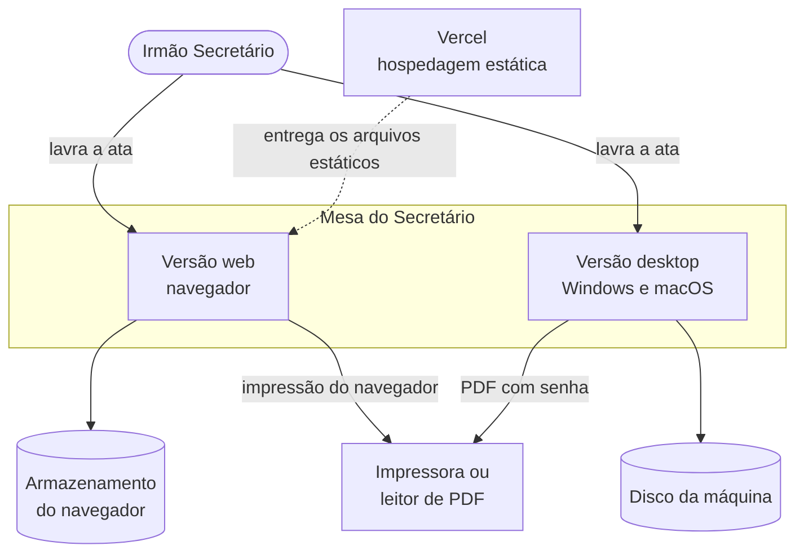
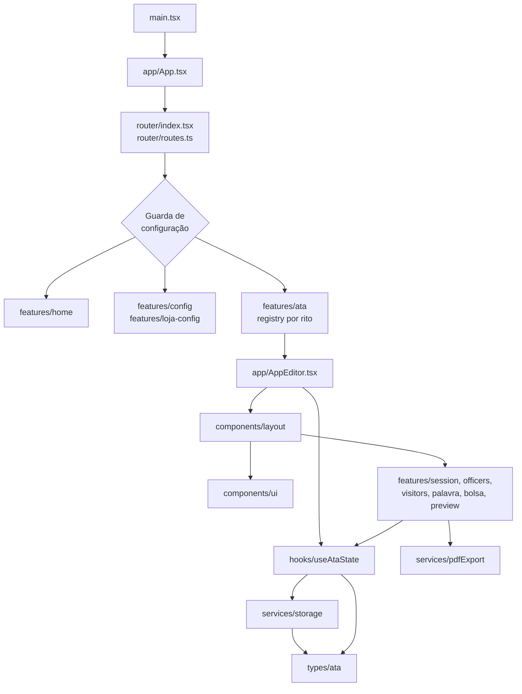
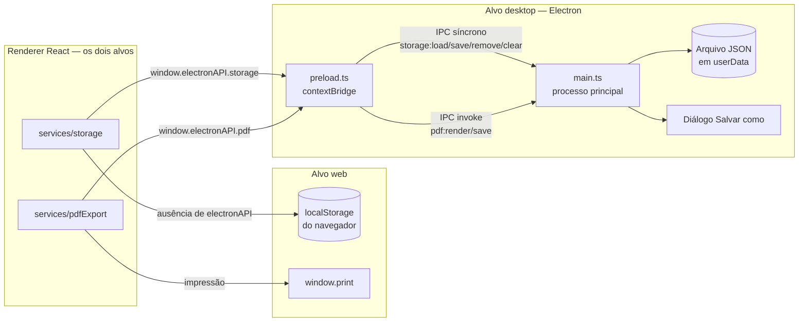
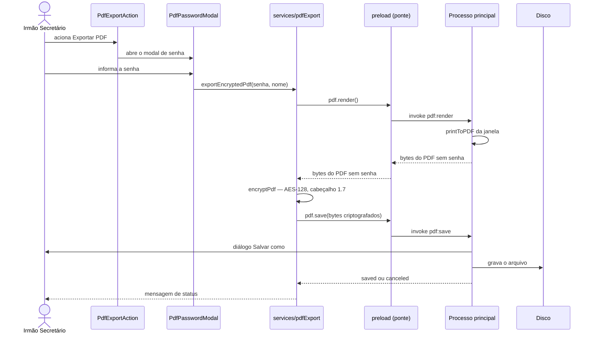
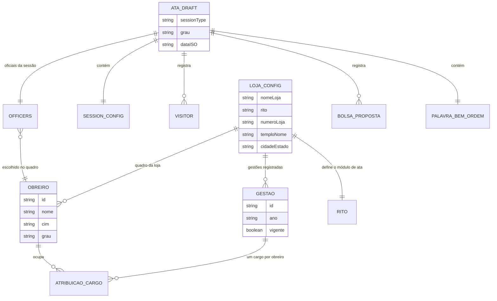
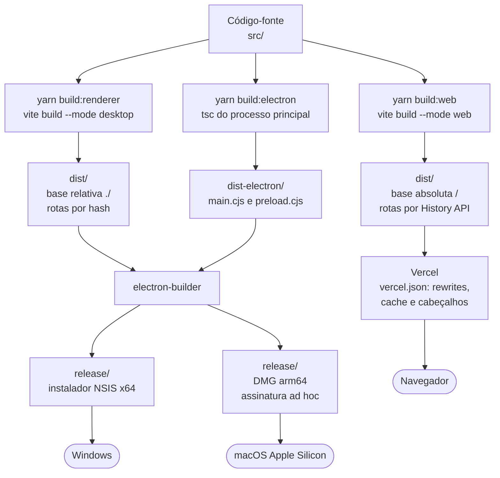
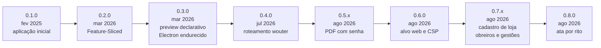
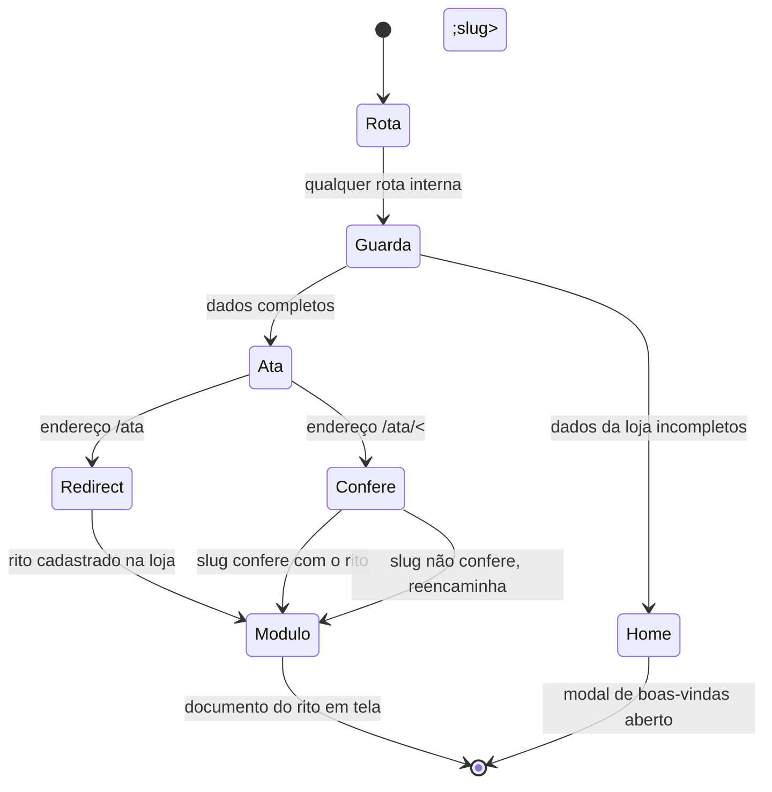

# Diagramas

Esta página reúne os diagramas de arquitetura do Mesa do Secretário. Cada um traz a legenda do que mostra e do que deliberadamente deixa de fora. Todos são escritos em Mermaid e renderizam direto na wiki do GitHub.

Apuração de 29 de agosto de 2026, na versão 0.8.0.

---

## Contexto

Quem usa o sistema e o que existe em volta dele.

_Não há servidor de aplicação, banco de dados remoto, autenticação nem chamada a API externa. A Vercel aparece apenas como hospedagem de arquivos estáticos: nada trafega do usuário para ela além do próprio carregamento da página._

---

## Arquitetura de Componentes

Os módulos internos e a direção real das dependências.

_A seta sai de quem importa. `components/layout` importa de `features`, e não o contrário — o que hoje acontece por caminho interno, e não pelo barrel export, conforme [Acoplamento e Dívida Técnica](Acoplamento-e-Divida-Tecnica). Componentes individuais foram omitidos: o diagrama recorta no nível de módulo._

---

## Arquitetura de Integração

Como a aplicação conversa com o que está fora do seu processo, em cada alvo.

_A escolha do caminho é feita em tempo de execução, pela presença de `window.electronAPI`. A ponte expõe exatamente dois grupos de canais, declarados em `src/electron/preload.ts`; o processo principal só aceita as seis chaves da lista fechada em `src/electron/main.ts:19`. A senha do PDF não aparece no diagrama porque não trafega: a criptografia acontece no renderer, e só os bytes já criptografados descem pela ponte._

---

## Fluxo Principal

Exportação da ata em PDF com senha, no alvo desktop — a operação que atravessa mais camadas.

_A senha existe apenas como argumento dentro do renderer: não é persistida, registrada nem enviada pela ponte. No alvo web esse fluxo não existe — resta a impressão pelo navegador._

---

## Modelo de Dados

O que é persistido e como as entidades se relacionam.

_Não há banco de dados nem esquema relacional: cada agregado é um documento JSON gravado sob uma das seis chaves de armazenamento (`ataDraft`, `officersConfig`, `lojaConfig`, `lojasCadastro`, `obreiros`, `gestoes`), definidas em `src/services/storage.ts:16`. As relações do diagrama são de referência por identificador dentro dos documentos, não de integridade garantida por banco. Os tipos completos estão em `src/types/ata.ts`._

---

## Distribuição e Execução

Do mesmo código-fonte a dois artefatos, com configuração divergente por alvo.

_A divergência de `base` entre os alvos é obrigatória: o Electron carrega o HTML por `file://` e precisa de caminhos relativos; a web precisa de caminhos absolutos para que rotas profundas encontrem os assets. A `Content-Security-Policy` é reescrita por alvo pelo plugin `csp-por-alvo`, e o build falha se a meta sumir do HTML._

---

## Evolução

Os marcos que mudaram estrutura, fronteira ou alvo de execução.

_Detalhamento em [Evolução Arquitetural](Evolucao-Arquitetural)._

---

## Diagrama de Resolução de Rota

Diagrama adicional, específico da decisão de 0.8.0: como um endereço vira o documento de um rito.

_A única rota sempre acessível, mesmo com a loja incompleta, é `/config/loja`._

---

## Ver Também

- [Arquitetura](Arquitetura) — o texto que estes diagramas ilustram
- [Evolução Arquitetural](Evolucao-Arquitetural) — o caminho até aqui
- [Build e Distribuição](Build-e-Distribuicao) — o passo a passo dos artefatos
